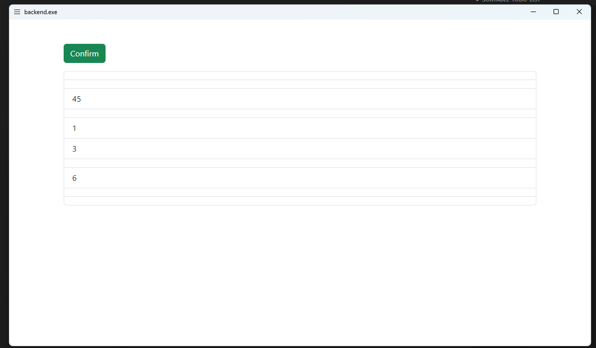

# Description

Small utility to reorder text and excel cells.
This uses AutoHotkey as backend and opens a gui running Sortable.js to reorder the cells.

# Installation

Download the prebuilt binary from the [releases](https://github.com/Lefted/sortable-selection/releases) page.

# Usage

- Select a text or excel cells you want to sort and press `Shift+Alt+O` to open the gui.
- Confirm your changes and your selection will be updated.

# Building

- Install [AutoHotkey v2](https://www.autohotkey.com/)
- Install the contents of [ahk2_lib](https://github.com/thqby/ahk2_lib) to your UserLib folder (%USERPROFILE%/Documents/AutoHotkey/Lib).
